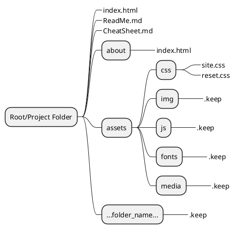
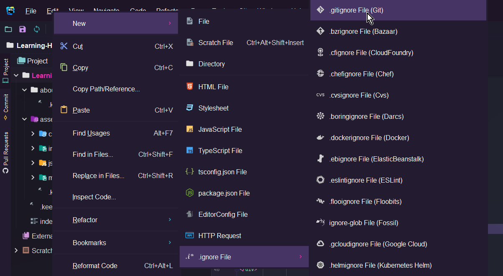
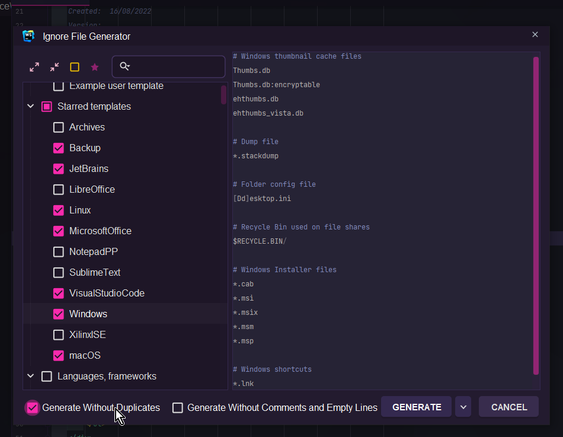
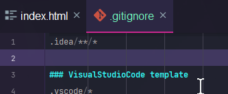

# Learning HTML, CSS and JS with Ady

Description here...

## Folder Structure

The following is an extract fo the site folder structure.

```text
Root -+- index.html
      |
      +- ReadMe.md
      |
      +- about -+- index.html
      |
      +- assets -+- js -+-
                 |
                 +- css -+- site.css
                 |
                 +- img -+- 
                 |
                 +- media -+- 
```

In Webstorm the following will render as a mind-map diagram showing the folders and files. 



## .gitignore

Create .gitignore with required file patterns.
> Use the plugin: .ignore in JetBrains IDEs
> 
> `CTRL`+`ALT`+`S` (on Windows) to open settings
> 
> Click the Plugins option (on left side)
> 
> Click on Marketplace to search for plugins not installed.
> 
> In the search box at the top type in a word that may be
> part of the plugin needed, eg. ignore
> 
> Locate the option and click INSTALL
>
> Click OK when all required plugins are installed.
> Sometimes the IDE will need to restart to apply the changes.

## Adding the .gitignore

Right mosue button on the Project Name

File

New

.ignore

GitIgnore (at top)



Select the options below



Edit the .gitignore file and add at the top:




## .keep
This file is used to force folders that are 'empty' to be committed...

Add to any folder you need to be added to version control but may not 
be using immediately.

Create it as a New Text file with the filename `.keep`.


### Useful Plugins
- .ignore
- CSV
- Rainbow Brackets
- Indent Rainbow
- JSON Helper
- Markdown Editor
- Paste Images into Markdown
- Zero Width Character locator
- Yet another emoji support
- GitToolBox
- Extra ToolWindow Colorful Icons
- Atom Material Icons
- .env files support

