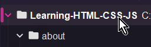

# Exercise 00

This exercise sets up a new project and the base folder structure.

Create a new project in WebStorm called `Learning-HTML-CSS-JS`.

## Using Command Prompt to Create Folders

Start by opening a COmmand Prompt session in the terminal by using these steps:

Click on Terminal or use `ALT`+`F12`.

Locate the V or two arrows (depending on your plugins), and click.


In the dropdown context menu, click on Command Prompt.


> The prompt should show the folder including `Learning-HTML-CSS-JS`.
>
> If your prompt shows PS at the front then you are running PowerShell.
> 
> The following commands may not work as expected if you use PowerShell.

Use the command prompt to issue the commands to create the folders:
```shell
mkdir assets
mkdir assets/img
mkdir assets/js assets/css assets/media
mkdir about
```

Now create an empty text file called `.keep` and add to each folder.
   - Click on the Project's 'root' folder:
   - 
   - This will ensure that the new `.keep` files will be in the correct location.

To create the first copy of `.keep` use `ALT`+`INSERT` and when the pop-up is shown 
select `FILE` (If all is well, it will be highlighted by default, so you should 
be able to press `ENTER`).


Next type in `.keep` and press `ENTER`


Now you are able to select the file and press `CTRL`+`C` to copy it to clipboard.

Click on the folder you wish to add a copy to, eg `assets`, and press `CTRL`+`V` to paste it in.

Repeat for the other folders (`assets`, `img`, `css`, `js`, `media`, `about`, etc.)

## Create a ReadMe file

Click on the project root folder.

Use `ALT`+`INSERT` and select `FILE` again

Type in `ReadMe.md` as the filename.

## Create a Cheatsheet File

Click on the project root folder.

Use `ALT`+`INSERT` and select `FILE` again

Type in `CheatSheet.md` as the filename.
