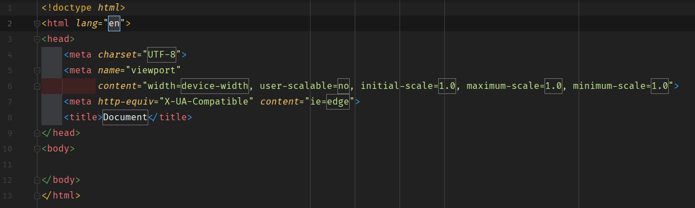
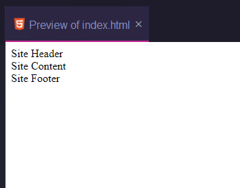

# Base HTML page

Create a new HTML file called `index.html` in the root of the project

Do this by clicking on the root folder name and then pressing ALT+INSERT.

Select HTML in the pop-up and then type in the name of the file, `index`. 
If you selected HTML as instructed then WebStorm will automatically add 
`.html` to the end of the filename. 

Make sure the full `HTML:5` header is present.
- hint: select all the content, delete the content, and then type `HTML:5` and press `TAB` for the Emmet coding to expand to the default. 



In the HEAD make the title "WebTech".

## Create first part of structure

In the `body` of the file, add the following three elements:
- `header`
- `div` with a class of `container`.
- `footer`

To make it easier to visualise, add the following text to each of these elements:

- in the `header` add "Site Header"
- in the `div` add "Site Content"
- in the `footer` add "Site Footer"

We are now going to add some comments to the HTML and CSS files.

## Index file comments

In the index file are adding some explanatory comments and information. Immediately after the `title` element add:

```html
<!-- 
    Filename: ./index.html
    Project:  PROJECT_NAME
    Author:   YOUR_NAME
    Created:  DD/MM/YYYY
    Version:  1.0
-->
```

Replace `PROJECT_NAME`, `YOUR_NAME` and the date (`DD/MM/YYYY`) with the appropriate content.

Next, after the above, ensure that there is a blank line and add:

```html
    <!-- Fonts -->

    <!-- CSS -->

    <!-- JS (Deferred) -->
```

Again leave a blank line between each comment and after the last one.

## Preview at this point



## Exercises

Create a folder called `exercises`, and place this `Exercise-01.md` file into the folder.

## Commit and Push

Add and commit the changes with a suitable message.

Push the changes to your Repository.
