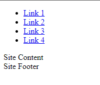

# Exercise 02

In the assets/css folder create a new empty file called `site.css`

Download a copy of the HTML Reset file from (https://elad2412.github.io/the-new-css-reset/)[https://elad2412.github.io/the-new-css-reset/]

Going to the above will open the file in the browser. You can simply use `CTRL`+`S` to save the file to the Downloads folder.

Move this `reset.css` file into the `assets/css` folder.


## Modifying the HTML
We are now going to edit the `index` page...

### Document `head`
In the head add links to the two CSS files, reset.css and site.css:

Hint: 
```html
<link rel="stylesheet" href="./assets/css/reset.css">
```

### Site Header

Modify the page header to have a class of `site-header`.

Remove the text `Site Header` and replace with the following nesting inside the site header:
- A `div` with a class of `branding` and the content `WebTech`.
- A `nav` element with an unordered list containing four list items.
- Each list item is to have an anchor `a` element with a `href` of `#` and text of `Link X`.

Commit the changes with a suitable message, and push them to your remote.

## Site Preview at this point


